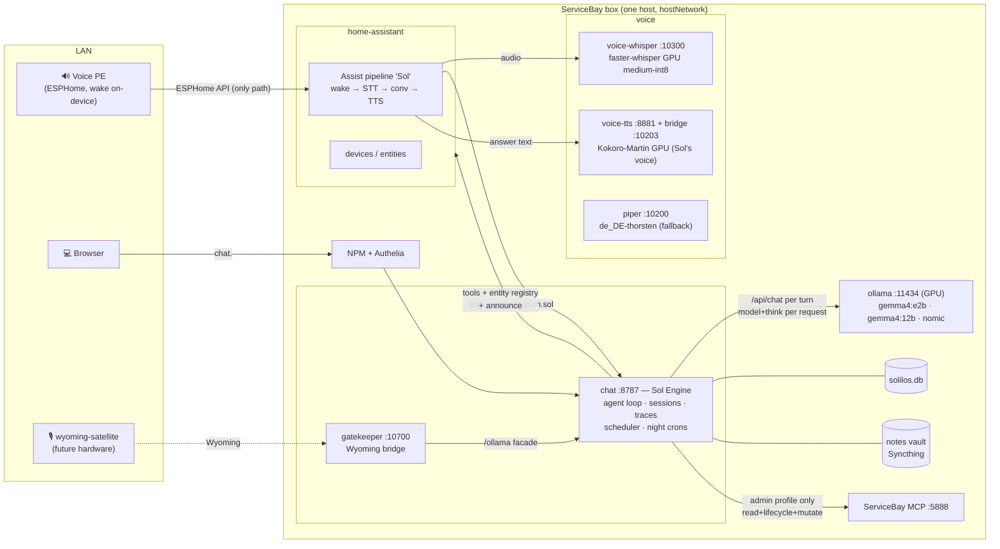
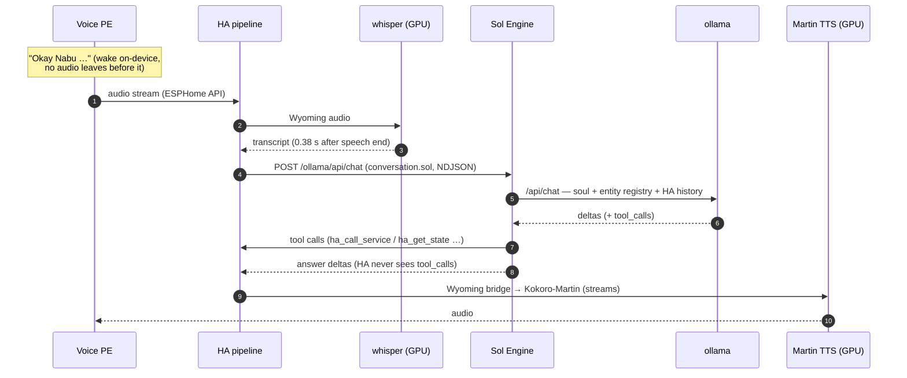
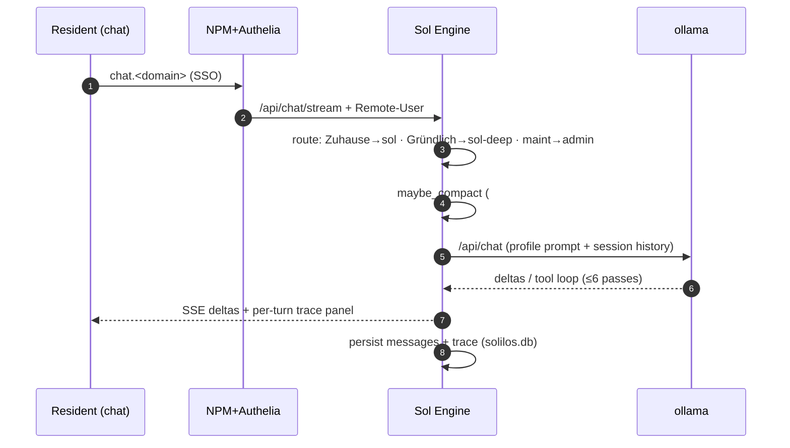
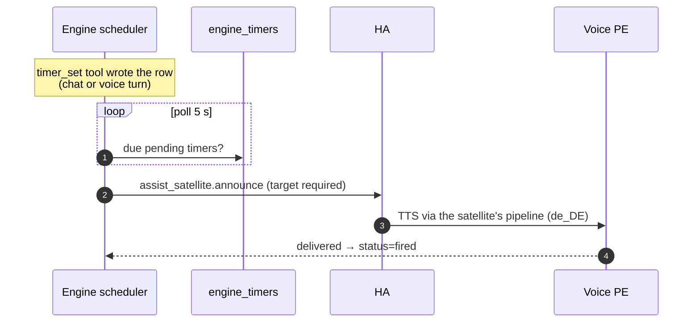

# Solilos architecture

Canonical reference for the Solilos household AI assistant. For the
deployment layout (templates, images, install paths) see
[`README.md`](README.md).

---

## 1. Inference engine

Ollama on the box (RTX 2000 Ada 16 GB). All three models stay resident
(`OLLAMA_MAX_LOADED_MODELS=3`, ≈12 GB total at the 32k window) — the
night-cron eviction of the fast model is structurally impossible.

| Model | Role |
|---|---|
| `gemma4:e2b` | Fast: household/voice and fast everyday turns |
| `gemma4:12b` | Thorough: deep mode, admin, background crons |
| `nomic-embed-text` | Embeddings (own runner, never competes for the gen slot) |

`gemma4:e4b` is deliberately NOT in the map. Box bench 2026-06-12
(`solilos-chat/scripts/bench_models.py`, engine-shaped ~2.5k-token prompt with
the injected entity registry, think=false, 3 runs):

| Model | wall p50 | wall p95 | TTFT p50 | tool accuracy |
|---|---|---|---|---|
| e2b | 0.72 s | 1.04 s | 0.78 s | 18/18 |
| e4b | 0.90 s | 1.39 s | 0.97 s | 18/18 |
| 12b | 1.57 s | 2.51 s | 1.54 s | 18/18 |

With the lean prompt all three pick entities perfectly, so e4b buys no
measurable accuracy for +25% latency. Revisit only if e2b shows quality
failures in trace data — e4b is the designated next candidate then.

**Model and thinking are per-turn parameters** of the Sol Engine (the
in-process agent core that replaced the Hermes gateways): household/voice
turns run e2b with `think=false`; thorough turns run 12b with thinking.
No gateway indirection, no per-session model binding.

Context window: 32 768 tokens (`OLLAMA_CONTEXT_LENGTH=32768`). The earlier
131k window existed only because the Hermes-era base prompt had grown to
~25k tokens; the engine's ≤3k prompt leaves ~29k conversation room and the
saved KV budget is what fits all three models on the GPU.

Speculative decoding / MTP is not attainable on the current CUDA/GGUF stack;
that decision is final (see repo history / #189).

No embeddings are wired yet. When semantic search is added it will target a
dedicated `nomic-embed-text` instance on a separate Ollama runner so it does
not compete for the generation slot.

---

## 2. The Sol Engine (Hermes fully replaced)

Decision 2026-06-11: Hermes was a generic multi-platform agent framework;
Solilos needs a narrow, latency-critical household agent. Measured on the
box, the Hermes household prefill was 12,689 tokens p50 (66% tool
definitions) and the workaround stack (mutating trace proxy, 3-gateway
construct, `.no-bundled-skills`, config-agent sidecar, 2,800-line
post-deploy) grew with every feature. The system was not live, so Hermes
was replaced **outright** — no strangler.

The engine is a module inside `solilos-chat`
(`src/solilos_chat/engine/`): one process owns turn, loop and capture.

- **Agent loop** directly on Ollama `/api/chat` (streaming, tool dispatch,
  ≤6 passes). Model + thinking are **per turn**; a "profile" is a
  constructor call (`household` = e2b/no-think + registry, `sol-deep` =
  12b/think, `admin` = 12b + operator prompt + `servicebay_admin` MCP) —
  what used to be a container-and-port.
- **Prompt assembly per profile**: soul (mtime-cached file) + skill
  markdown + the **HA entity registry** (controllable domains,
  `entity_id | name | area`, NO live state — HA Assist's own approach,
  saves the list-entities pass) + per-session overlay. Household prefill:
  ~2.1k tokens (was 12.7k, −84%, box-verified).
- **Tools** are hand-written and token-lean: `ha_call_service` /
  `ha_get_state` / `ha_list_entities`, `timer_set/list/cancel`,
  `web_search`/`web_extract` (ddgs, Tavily optional), `notes_search` /
  `notes_read` / `note_write` / `fact_store`. The notes tools are the
  retrieval seam future Immich/CalDAV retrievers plug into (§3).
- **Sessions** live in `solilos.db` (`engine_sessions`/`engine_messages`,
  ownership a plain column — the `[uid:]` title-marker era is over).
- **Native tracing**: every Ollama call recorded at the call site, same
  ring/detail/`session_traces` shapes as the retired proxy; calls carry
  the session id directly (no wall-clock correlation).
- **Scheduler**: timers/alarms/reminders in `engine_timers`; firing rings
  the Voice PE via HA `assist_satellite.announce` (target required —
  box-verified). HA stays the device tool; the schedule lives here.
- **Night crons** (daily-chronicle 23:59, problem-summarizer Mo 04:30,
  chat-compactor 04:15) are code-defined jobs on the deep profile with
  durable last-run stamps (`engine_cron_runs`) — idempotent by
  construction; first boot baselines instead of back-running.

### System picture

GPU budget (16.4 GB): e2b + 12b + nomic resident ≈ 12.6 GB, whisper
medium-int8 ≈ 1.1 GB, Kokoro-Martin TTS ≈ 1.2 GB — ≈ 14.9 GB total,
everything stays loaded, no eviction churn (watch this headroom).

### Voice (the PE speaker path)

The Voice PE is an ESPHome device that speaks only to HA, so the path is
**Speaker → HA Assist pipeline → Sol → HA → Speaker**. HA 2026.6's
`openai_conversation` has no custom base_url; its **`ollama` integration**
takes a free URL + Bearer api_key — so the engine exposes an
**Ollama-compatible facade** (`/ollama/api/tags`, `/ollama/api/chat`) and
is wired as the Assist conversation agent (`conversation.sol`, model
`sol`). The post-deploy registers wyoming whisper/piper, creates the
entry + conversation subentry and the "Sol" pipeline, sets it preferred
and assigns the PE's pipeline select. The facade is stateless: HA owns
the conversation history; the engine folds HA's prompt after its own
system block and runs its tool loop server-side (HA never sees
tool_calls). The **voice-gatekeeper** speaks the same facade
(`stream:false`, rolling per-conversation history) for wyoming-satellite
hardware.

Measured end-to-end (real spoken turns + live bench, 2026-06-12):

| Segment | Measured |
|---|---|
| speech end → transcript (GPU medium-int8) | **0.38 s** (CPU base was 0.76–2.86 s) |
| TTS first audio (Kokoro-Martin GPU) | **0.03–0.36 s** (picked by ear over piper, servicebay#1815) |
| transcript → Sol answer complete (e2b, warm) | 0.88–1.0 s |
| facade TTFT plain / tool turn | 0.5–0.75 s / 1.3 s |
| **speech end → answer ready** | **≈ 1.3–1.4 s** (gate ≤ 3 s) |

Whisper runs as the `voice-whisper.container` Quadlet on the GPU
(servicebay#1809: kube play drops CDI devices, so the STT container left
the pod — same `.container` fixup as ollama). gemma4 advertises an
`audio` capability but no Ollama API path accepts audio (solbay#337), so
the dedicated STT stage stays — it is also what makes mishearings
visible in traces. The one-pass audio design (audio + "return a
transcript field") is parked on the gatekeeper path until Ollama wires
audio input.

### Other flows

Night crons and admin ride the same engine: `CronRunner` polls
`engine_cron_runs` slots (local time) and runs daily-chronicle /
problem-summarizer as ephemeral 12b turns whose output is `note_write`
into the vault; chat-compactor walks stale long sessions through
`compaction.compact_session(force=True)`. The admin persona is the
maintenance embed's profile — operator soul + admin skills as prompt,
ServiceBay MCP tools fetched lazily per turn from :5888 with the minted
token file.

### Routing

- Chat surface: pinned Zuhause + household topic → `household` (e2b);
  "Sol Gründlich" persona / thorough preference → `sol-deep` (12b); the
  `?persona=servicebay-maintenance` embed → `admin`, gated on
  Remote-Groups∋admins at the router.
- The admin profile is the only one carrying `servicebay_admin` (token
  scopes read+lifecycle+mutate, no destroy/exec; minted by the post-deploy
  into `<DATA_DIR>/solbay/sb-admin-token`, read lazily per connection).
- Voice (facade) defaults to `sol`; an explicit "think harder" cue routes
  the gatekeeper to `sol-deep`.

What stays per turn in the chat server: speed → think (#222/#278), topic
binding + `#topic/<slug>` hint (#241/#243), pinned Zuhause (#237),
`[Aktuelle Zeit]` injection (#265), incognito guard (#246), compaction
(#210 — per-turn hard cap + the nightly stale-chat pass).

---

## 3. Knowledge architecture (4 layers, CQRS)

Reads go to the right layer; writes and actions flow via MCP/API (CQRS).

| Layer | Store | Status |
|---|---|---|
| **L1 — episodic / user facts** | Hermes-native `holographic` provider | active |
| **L2 — freeform text** | Obsidian notes vault (`/opt/data/notes`, Syncthing) + `notes-search` skill; `qmd` semantic upgrade optional | active |
| **L3 — structured knowledge** | `solilos.db` (SQLite) — today: `system_settings`, `cloud_audit`, `voice_embeddings`; Phase-3a domain collections + entity/interaction graph **deferred** to gbrain v0.43+ (gbrain's typed self-wiring did not work in v0.42) | partial |
| **L4 — live device state** | HA-native `homeassistant` toolset | active |

The `solilos.db` schema is managed by Alembic migrations in `database/`
(hand-rolled SQL via `op.execute`; portable to Postgres if Phase 3a calls for it).
See [`database/README.md`](database/README.md) for the migration runbook.

---

## 4. Topics / Contexts

A **Topic** is a cross-cutting, persistent label that groups a theme, project,
or context across chats, notes, and future graph nodes.

> **Pivot (#279) — user-facing tagging is mention-based, not a picker.**
> The structured **Thema topic-picker** built in #241/#242 is *retired* as the
> user-facing entry point: the topic list couldn't be user-edited and residents
> don't want to curate a fixed list. It is replaced by inline **`#tag`**
> (tags) and **`@person`** (persons) mentions typed directly in the chat. The
> **system topic *binding* stays internal** — the Zuhause chat still runs on
> `gemma4:e2b` + the household soul (now via the household **profile**, §2,
> not a per-session topic override), the `topics` table and its
> `household` / `servicebay-admin` system rows remain as internal plumbing. Only
> the *user-facing picker* is replaced. The split is explicit: **internal
> binding** (D2, unchanged) vs **user-facing tagging** (mentions, below). The
> picker-era design that follows is kept as history and marked
> **superseded-by-#279** where it described the retired user surface.

### Built-in topics

| Topic slug | Type | Model | Persona |
|---|---|---|---|
| `household` | system | e2b | household soul |
| `servicebay-admin` | system | 12b | admin soul |

### User topics (examples)

`finanzen`, `daggerheart`, `krankenkasse`, `arbeit`,
`projekt/wintergarten`, `projekt/garagenumbau`, …

### Operator decisions

**D1 — one primary topic per chat.**
A chat has exactly one *primary* topic and may carry any number of *secondary*
tags. This keeps routing and persona assignment deterministic.

**D2 — a topic carries a primary model + persona.** *(model/persona override
superseded-by-#293 — see §2.)*
Originally, assigning a topic to a chat set the chat's default model and persona
via the topic's `default_model` / `default_persona` columns, injected by the
proxy at session create. **#293 retired that override:** the household gateway's
profile now owns the model + soul, so the proxy no longer injects a per-session
model override or persona overlay (the topic columns stay in the schema but are
no longer consulted at create). What survives of D2 is the **topic binding as a
tag**: a chat started under a topic is persisted as its primary assignment and
its turns get the `#topic/<slug>` context hint (#241/#242), routing ingestion —
it just no longer changes the model/persona, which the profile pins.

*Binding is at session create.* Hermes binds model + system_prompt only when a
session is born (the latency bundle — the model can't switch per-turn). Post-#293
the **profile** supplies both at create; the proxy passes neither. Changing the
primary topic on an **existing** session still updates the chip/label and future
`#topic/` ingestion tags but reuses the same Hermes session (one create), so it
never rebinds the live session — the #242 limitation, now moot for model/persona
since those are profile-owned.

**D3 — scope default is per-resident.**
Per-resident isolation is the baseline (#153). A topic can be widened to
*shared* (household, accessible to all residents) or *admin*.

**D4 — topic creation is suggested AND manual.**
Sol detects a recurring theme mid-conversation and asks "Soll ich das als
eigenes Topic anlegen?" Manual creation is always available.

### Schema

**`topics` table** (registry, in `solilos.db`):

| Column | Type | Notes |
|---|---|---|
| `slug` | TEXT PK | e.g. `projekt/wintergarten` |
| `display_name` | TEXT | Human label |
| `parent` | TEXT FK→topics | Hierarchy: `projekt/wintergarten` → parent `projekt` |
| `scope` | TEXT | `resident` / `shared` / `admin` |
| `owner_uid` | TEXT | LLDAP uid; null for system topics |
| `default_model` | TEXT | `e2b` / `12b` / null (inherits) |
| `default_persona` | TEXT | Soul slug or null |
| `color` | TEXT | Hex accent for the UI chip |
| `archived` | INTEGER | 0/1 |

**`session_topics` table** (chat↔topic assignment):

| Column | Type | Notes |
|---|---|---|
| `session_id` | TEXT FK | Hermes session id |
| `topic_slug` | TEXT FK→topics | |
| `role` | TEXT | `primary` / `secondary` |
| `owner_uid` | TEXT | Resident who assigned it |

### UI surfaces (picker era — superseded-by-#279)

These were the #241/#242 user surfaces. The **Topic picker** is *retired* by
#279 (replaced by §"Mention-based tagging" below); the chip and pinned-chat
surfaces survive in spirit (the tag-cloud and the Zuhause pin).

- ~~**Topic picker** in the chat header (alongside Schnell/Gründlich and
  persona selector).~~ — *retired (#279); replaced by inline `#tag`/`@person`
  mentions + the tag-cloud.*
- **Topic chip** in the session list (visual at-a-glance).
- **Pinned topic-chats** in the rail — pre-assigned topic + model/persona
  (the #237 pattern extended to user topics).

### Mention-based tagging (#279 — replaces the picker)

The user-facing surface is now **inline mentions** typed in the chat, not a
header picker:

- **`#tag`** — a free-form tag. **`@person`** — a person reference. Both are
  parsed out of the message text as the resident types.
- **Autosuggest while typing.** Typing `#` or `@` opens an autosuggest popover
  (the existing slash-menu pattern). `#` suggests from **already-known tags**
  (tags used before); `@` suggests from **known persons**. *Decision: build
  both `#tags` and `@persons` now* — `@person` suggestions are seeded from
  residents / the uid registry plus a manual list. CardDAV/contacts enrichment
  (#207, parked behind gbrain) extends the person suggestions *later* when it
  lands; the mention surface ships without waiting for it.
- **Tag-cloud.** The tags and persons used in a chat render as a cloud **to the
  right of the chat on desktop** (when there's room) **or as a small line
  directly above the message input** otherwise (responsive). Each tag/person in
  the cloud **links back to the message where it was used** (jump-to-message
  anchor).

**Internal vs user-facing.** This replaces only the *user-facing picker*. The
system topic **binding** (D2) survives as the internal primary-tag + context
hint: the Zuhause chat still runs `gemma4:e2b` + the household soul (now via the
household **profile**, §2 — not a per-session topic override, superseded-by-#293),
and the `topics` table keeps its system rows (`household`, `servicebay-admin`)
as internal plumbing — residents simply never pick from a topic list anymore.

**Storage (open — child units decide).** Where mentions are persisted per
chat + per message is left open by this note: either a dedicated **`tags`
table** (+ a per-message tag/person link), or **repurposing `session_topics`**
with a per-message tag link alongside it. This is a design note; the builder of
the child units picks the specifics.

**Planned decomposition (#279 child units).** This note unblocks the build,
which #279 splits into:

1. **`#tag` parse + autosuggest + store** — parse `#` mentions, suggest from
   known tags, persist them.
2. **Tag-cloud UI + jump-to-message** — the responsive cloud (desktop-right /
   mobile-line) with jump-to-message anchors.
3. **`@person` parse + seed + autosuggest** — parse `@` mentions, seed persons
   from residents / a manual list, suggest from known persons.
4. **Retire the Thema picker** — remove the `#topic-control` picker + the
   `FIXED_CONTEXT_TOPICS` gating (#274); the internal binding stays.

### Data → topic tagging (the heart of the system)

Every ingestion from a topic-T chat auto-stamps `#topic/<slug>`:

| Ingestion path | Tag mechanism |
|---|---|
| Notes (media-ingestion-multimodal, dynamic-skills facts, daily-chronicle) | Frontmatter `#tags:` — these already write `#tags`; the active topic tag is appended |
| Future Immich photos | Topic album |
| Holographic facts (L1) | Topic metadata field |
| Future `solilos.db` L3 records | `topic` column / graph edge |

Mechanism: the proxy injects the active topic slug into each turn's system
context. Any ingestion skill that runs during that turn reads it and stamps
`#topic/<slug>`.

### Retrieval

- `notes-search` filtered by `#topic/<slug>` (works today once tagging lands).
- **Topic dashboard**: all notes, images, facts, and events for a topic in one
  view.
- Future: graph query by topic label (gbrain v0.43+).

---

## 5. Temporary / Incognito chats

Ephemeral by default: no durable session persistence, no auto-ingestion, no
memory/learning writes, no compaction. The session is deleted on close — like
browser incognito.

**Retroactive selective persistence** — the escape hatch: mid-conversation the
resident can say "Erstelle hieraus eine Notiz im Topic Finanzen." The proxy
reads the live context, writes exactly that note (tagged with the chosen topic)
via the normal ingestion path, and leaves everything else ephemeral.

| Property | Ephemeral session | Normal session |
|---|---|---|
| Compaction | skipped | runs at ~90–95% context |
| Auto-ingestion | skipped | active |
| Memory/learning writes | skipped | active |
| Explicit "extract to note" | available | n/a |
| Session on close | deleted | persisted |

Mechanism: an ephemeral flag on the session (carried in the `[temp:]` title
marker alongside the topic markers); the proxy checks it before every write
path. The incognito `[temp:]` prefix + the per-turn guard hint are retained as a
per-session lever after the #293 overlay simplification (§2) — the profile owns
the soul, but incognito is still the proxy's.

---

## 6. Phasing

**v1 (no gbrain dependency):**
Topics registry + `session_topics` + per-topic primary-tag binding (model/persona
now profile-owned, §2, superseded-by-#293) +
auto-`#topic/` tagging + topic-filtered notes-search + topic suggestion +
temporary/incognito chats. The user-facing **topic picker** (#241/#242) is
*superseded by #279* — replaced by inline `#tag`/`@person` mentions +
autosuggest + the tag-cloud (see §3 "Mention-based tagging"); the internal topic
bindings stay.

**v2 (gbrain v0.43+):**
Topics become first-class graph nodes/labels. Chat→topic and data→topic
assignments become typed edges. Cross-source topic retrieval runs over the
graph. The v1 `#topic/<slug>` tags map 1:1 to graph labels — forward-compatible,
no migration of tagged notes required.

---

## 7. Cross-cutting constraints

- **Per-resident isolation** (#153) — session ownership, topic scope, and data
  writes are all resident-scoped by default.
- **Pinned-persona / marker pattern** (#229/#237) — topic assignment reuses the
  same session-marker mechanism as persona pinning. Post-#293 (§2) the soul is
  pinned by the gateway **profile**, not a per-session overlay; the marker
  pattern persists for topic + incognito tagging.
- **Notes `#tag` mechanism** — already used by media-ingestion, dynamic-skills,
  and daily-chronicle; topic tagging extends it without a new convention.
- **Minimal knobs** — one global/automatic mechanism per concern, not per-feature
  toggles. Topic routing and ephemeral flags follow this principle.
